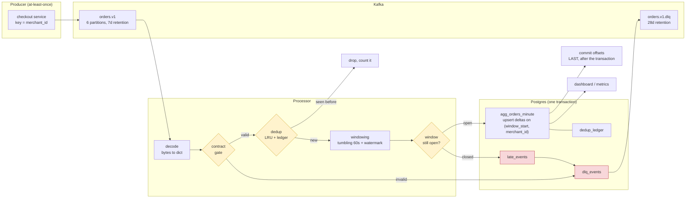
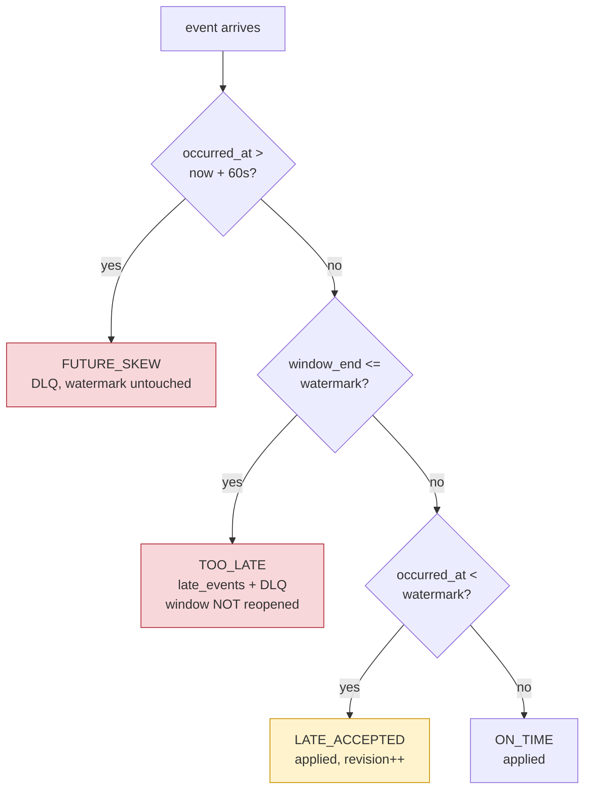

# kafka-streaming-aggregates

[](https://github.com/JanIzmer/kafka-streaming-aggregates/actions/workflows/ci.yml)

A streaming pipeline that reads order events from Kafka and maintains
per-minute aggregates in Postgres. The whole point of it is the two things a
naive consumer gets wrong: **duplicates** and **late-arriving events**.

Runs end to end locally with `make up && make demo` — Redpanda, Postgres, a
synthetic producer that deliberately emits duplicates, stragglers and poison
records, and the processor that has to cope with all of them.

---

## Flow



### How an event is classified



An event is judged against the watermark **as it was before that event** —
otherwise the newest record always sets the watermark it is measured by, and
nothing is ever late.

---

## Quickstart

**Docker, and nothing else.** No external account anywhere — Redpanda and
Postgres run locally and the producer generates its own traffic.

```bash
cp .env.example .env
make up          # redpanda + postgres + processor; console on :8090
make demo        # four scenarios: clean, duplicates, late-burst, poison
make aggregates  # what landed
make lateness    # what missed its window
make dlq         # what was refused, and why
make dedup-proof # every record accounted for, exactly once
```

`make dedup-proof` is the one that demonstrates the central claim. It prints how
every record was treated and what actually reached the windows: the outcome
counters must sum to exactly what the producer sent, and `on_time +
late_accepted` must equal the events applied. On the run above: 4397 applied +
1655 duplicates + 310 too late + 75 contract violations + 44 malformed + 19
clock skew = 6500 produced, with 4397 rows aggregated.

Unit tests need no broker and no database:

```bash
make install && make test    # 76 tests
```

Ports, integration-test setup and the knobs worth understanding before changing
them: [`docs/setup.md`](docs/setup.md). **CI needs no secrets.**

---

## What is in here

```
contracts/order_event.v1.json   the contract, including the streaming guarantees
src/orders_stream/
  contract.py                   loads it and validates records against it
  codec.py                      bytes -> dict, with typed "never retry" failures
  models.py                     events, windows, aggregates; epoch-aligned buckets
  dedup.py                      two-tier dedup over event_id
  windowing.py                  watermark, tumbling windows, late classification
  store/                        schema + the single-transaction sink
  processor/pipeline.py         the routing table, no Kafka or SQL in sight
  processor/service.py          the run loop: flush, then commit, in that order
  producer/generator.py         synthetic traffic with injected faults
tests/                          76 unit tests + integration tests behind a flag
```

Detail: [setup](docs/setup.md) ·
[delivery semantics](docs/delivery_semantics.md) ·
[late data](docs/late_data.md) ·
[failure modes](docs/failure_modes.md) ·
[runbook](docs/runbook.md) ·
[cost & sizing](docs/cost_and_sizing.md)

---

## Duplicates

The producer is at-least-once, so duplicates are **expected input**, not an
anomaly. They arrive from four places, and each needs a different defence:

| Source | Caught by |
|---|---|
| Producer retry after an ambiguous ack | in-memory LRU (200k ids) |
| Consumer restart replaying from the committed offset | durable ledger in Postgres |
| Rebalance re-delivering in-flight records | durable ledger |
| Producer retry inside one poll | in-batch check |

The last one is the one usually missed — nothing has been committed yet, so
neither tier can see it. It was also a real bug in this repo, found by a test
([`cfe13a2`](../../commit/cfe13a2)).

**The ledger is written in the same transaction as the aggregates.** That is
the entire guarantee:

```
1. BEGIN  upsert deltas + ledger + late + dlq  COMMIT   <- Postgres
2. publish dead letters                                  <- Kafka DLQ
3. snapshot window state
4. mark ids seen in memory
5. commit consumer offsets                               <- Kafka, LAST
```

| Crash between | Durable | On restart |
|---|---|---|
| before 1 | nothing | replay applies the batch once |
| 1 and 5 | aggregates **and** ledger | replay is dropped by dedup; totals unchanged |
| after 5 | everything | nothing to replay |

Committing offsets first — the default in every Kafka client — turns that
second row into silent data loss. Hence `enable.auto.commit: false`.

The aggregates are upserted as **deltas** (`total = total + EXCLUDED.total`),
not absolute values: after a restart the in-memory state of an open window is
gone, and writing an absolute total from partial state would overwrite what is
already in Postgres with a smaller number. Deltas are only safe *because* of
dedup — the two mechanisms do not work apart.

`distinct_users` cannot be a delta, so membership is stored in `window_user`
with `ON CONFLICT DO NOTHING` and the count is derived. Exact and idempotent,
where HyperLogLog would be approximate and a counter would be wrong.

---

## Late data

* **Windows**: tumbling, 60s, aligned to the epoch — so a replay produces
  identical boundaries.
* **Watermark**: `max(event_time) - allowed_lateness`, monotonic.
* **A window closes** when the watermark passes its end; before that it is
  upserted continuously, so the table shows the current minute filling up.
* **`allowed_lateness` is an out-of-orderness bound**, not a grace period after
  closing. It buys tolerance *before* a window closes. The consequence: the
  late-but-accepted band is at most one window wide, and raising the bound is
  the only way to accept older stragglers — at proportional state cost.
* **Out-of-order is not late.** An older timestamp than its predecessor is
  normal; it is late only once the watermark has passed it.

**Restatements are visible.** An accepted late event increments
`late_events_applied` and bumps `revision`. A downstream reader that sees
revision go 3 → 4 knows the number changed; "the row was updated" cannot
distinguish a correction from a window still filling.

**Too-late events are never dropped and never resurrect a window.** They go to
`late_events` with their lateness and the watermark at the time, plus the DLQ.
Reopening a closed window would retroactively change a number a dashboard has
already shown, with no record that it happened. Instead the question "why is
12:03 lower than the source system?" has a SQL answer.

**State is bounded**: `open windows ≈ merchants × (allowed_lateness /
window_size)` — about five per merchant by default. Closing evicts, and an idle
partition advances its watermark on wall clock so a merchant that stops trading
does not pin a window open forever.

---

## Failure modes

Full table with detection and recovery: [`docs/failure_modes.md`](docs/failure_modes.md).

| Failure | Detected by | Automatic response | Human action |
|---|---|---|---|
| Unparseable bytes (bad JSON/UTF-8/not an object) | `MalformedRecord` | DLQ, **commit the offset**, keep going | inspect `dlq_events` |
| **Poison record retried forever** | — | prevented by design: never retried | none — this is the outage the DLQ exists to avoid |
| Contract violation | `Contract.violations` | DLQ with the specific reason, **ledger row still written** so a replay does not re-emit it | fix the producer, then `replay-dlq` |
| Unknown `event_type` | contract enum | DLQ, not ignored and not counted | adopt it in a new contract version, or reject it |
| Unknown extra field | schema diff | passes through, logged **once per field** | decide whether to adopt |
| Producer clock skew (>60s ahead) | `FUTURE_SKEW` | refused, **watermark untouched** | one bad clock would otherwise close every window in between, permanently |
| Event behind watermark, window open | classification | applied; `revision`++ | none |
| Event after its window closed | classification | `late_events` + DLQ; window **not** reopened | if frequent, raise `allowed_lateness` — a decision with a state cost |
| Partition goes quiet | idle watermark | watermark advances on wall clock, windows close, state evicts | none |
| Postgres down | `flush` raises, `flush_failures_total`++ | offsets **not** committed, state **not** snapshotted → nothing lost; backpressure as lag | fix Postgres; it drains by itself |
| Flush partially succeeds | — | cannot happen: one transaction | — |
| Consumer killed mid-batch | — | unflushed work replays; flushed work is in the ledger and is dropped | none |
| Rebalance takes partitions away | `on_revoke` | flush **before** releasing; cooperative-sticky so only moving partitions are affected | none |
| Two instances process one key | — | cannot happen while the key is the partition key | changing the key requires a new topic |
| DLQ topic unavailable | producer error | idempotent retries; then the flush raises and replays | table stays exact via a unique index on (topic, partition, offset) |
| New group starts at the wrong offset | — | `auto.offset.reset=earliest` — reads the backlog instead of skipping it | — |
| Lag grows steadily | `watermark_lag_seconds` (leading), group lag (confirming) | — | Postgres → flush interval → partition count → hot key, in that order |
| Ledger grows unbounded | disk | purged every 15 min, in bounded batches to avoid a long lock | manual `DELETE` if the processor was crash-looping |
| **Replay older than 48 h** | — | **not** protected: the ledger has forgotten those ids, so they re-apply | truncate the aggregate range first — see the runbook |
| **A unit changes silently** | **weak — nothing catches it** | — | the honest gap; only a distribution check would find it |

---

## Cost and sizing

At 200 events/s (17 M/day, ~2 GB/day compressed): roughly **$390/month**
self-managed — 3 brokers, one Postgres, two small containers — or about
**$0.75 per million events**. The brokers dominate, and they are sized for
availability rather than throughput.

Key decisions:

* **Six partitions.** It caps consumer parallelism, divides evenly into 1/2/3/6
  replicas, and leaves ~10x headroom. Raising it later re-routes existing keys,
  splitting a merchant's window across two consumers — so growth past six means
  a new topic, not an `alter`.
* **Keyed by `merchant_id`**, which is also the aggregation key. That is what
  removes any need for cross-instance coordination. The cost is hot-key skew,
  which no amount of scaling fixes.
* **7-day topic retention** = the replay budget, so an incident found on Friday
  is still repairable. **28 days for the DLQ**, because poison records are found
  late.
* **48-hour dedup ledger.** It is by far the largest table (~35 M rows
  resident), purged in bounded batches so the delete does not take a long lock
  while the processor is writing.
* **5-second flush interval**, trading staleness for transaction overhead —
  never for safety, since offsets are always committed after the write.

The honest note, also in [`docs/cost_and_sizing.md`](docs/cost_and_sizing.md):
at this volume a single Postgres instance consuming from a queue would cost a
fifth as much. Kafka earns its price with multiple independent consumers, a
replay requirement, or a peak far above the average.

---

## Testing

76 unit tests, no broker and no database — the suite must stay runnable with
nothing installed but Python, or it stops being run. They cover the things that
are expensive to get wrong: every dedup tier including the failed-flush case,
epoch-aligned bucketing, watermark monotonicity, the full late-data
classification, delta emission, and the routing table.

Integration tests (`-m integration`, behind `RUN_INTEGRATION=1`) run against
real Redpanda and Postgres in CI. They prove what unit tests structurally
cannot: that flush-then-commit, the SQL upsert and the durable ledger actually
compose — including that resetting the consumer group and replaying the whole
topic leaves the aggregates unchanged.

---

## Things I would change with more time

* Move the dedup ledger to Redis with a TTL. It is the highest-write table and
  the first thing to become the bottleneck past ~10 k events/s.
* Support a composite key for hot merchants plus a second aggregation step;
  today one large merchant is one hot partition.
* Emit the aggregates to a compacted output topic as well as Postgres, so
  downstream consumers can follow restatements as a change log rather than
  polling for `revision` changes.
* Add a distribution check on `gross_amount_minor` — the only realistic defence
  against a silent unit change at the producer.
