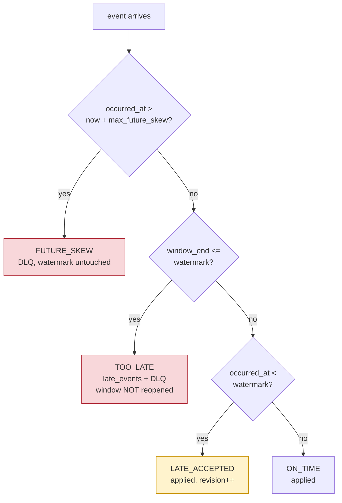

# Late and out-of-order data

## Two clocks, never mixed

* **event time** — `occurred_at`, set by the producer. Windows are built from
  this, always.
* **processing time** — when we read the record. Used only to advance the
  watermark when the stream goes quiet, and to measure how late something was.

Mixing them is the most common bug in a streaming aggregate. A processor that
buckets by arrival time produces different numbers every time it is replayed,
and neither run is reproducible or defensible.

## Windows

Tumbling, 60 seconds, aligned to the epoch:

```python
bucket = epoch_seconds - (epoch_seconds % window_size_seconds)
```

Aligned to the epoch, not to the first event seen, so two instances and a
replay all agree on boundaries. A window's identity is `(window_start,
merchant_id)` — which is also the primary key of the output table.

## The watermark

```
watermark = max(event_time seen) - allowed_lateness
```

It only moves forward. It is a statement about the input: *"I no longer expect
anything older than this."*

A window `[s, e)` closes when `watermark >= e`. Until then it is upserted
continuously, so the table shows the current minute filling up rather than
nothing at all.

### Classification

An event is judged against the watermark **as it was before that event** — an
event must not be judged by a watermark it set itself, or the newest record
would always be on time and nothing would ever be late.



### What `allowed_lateness` actually buys

It is an **out-of-orderness bound**, not a grace period applied after a window
closes. It delays the watermark, so it buys tolerance *before* closing.

A consequence worth stating plainly, because it is easy to assume otherwise:
the `LATE_ACCEPTED` band — behind the watermark, but in a window still open —
is at most one window wide. Anything older is `TOO_LATE` by construction.
Raising `allowed_lateness` is the only way to accept older stragglers, and it
costs state in proportion.

### Out-of-order is not the same as late

An event with an older timestamp than its predecessor is **normal**, not late.
It is late only once the watermark has passed it. Treating every out-of-order
record as an anomaly would flag most of a healthy mobile stream.

## Restatement

An accepted late event changes a window that has already been published. Two
things make that visible instead of silent:

* `late_events_applied` — how many late events this window absorbed;
* `revision` — bumped **only** by a restatement, never by normal in-progress
  accumulation. A downstream consumer that sees revision go from 3 to 4 knows
  the number it read has changed. "The row was updated" alone cannot
  distinguish a correction from a window still filling up.

## Too-late events are never dropped

An event whose window has closed is **not** applied and **not** discarded. It
goes to `late_events` (with its lateness in seconds and the watermark at the
time) and to the DLQ topic.

Re-opening a closed window would retroactively change a number a dashboard has
already shown, with no record that it happened. Keeping the event visible
instead means the question "why is the 12:03 total lower than the source
system's?" has an answer:

```sql
select merchant_id, window_start, count(*), round(avg(lateness_seconds))
from late_events
where recorded_at > now() - interval '1 day'
group by 1, 2 order by 3 desc;
```

If that query returns a lot, `allowed_lateness` no longer matches reality and
should be raised — which is a decision with a cost, not a silent default.

## Clock skew

An event claiming to be further in the future than `max_future_skew_seconds`
(60s) is refused outright and does not touch the watermark.

This is not paranoia. The watermark is derived from the maximum event time, so
a single event with a broken clock an hour ahead would drag it forward and
permanently close every window in between. That is unrecoverable without
replaying the topic, which makes it worth a hard guard.

## State size

```
open windows  ~  merchants x (allowed_lateness / window_size)
```

With the defaults (60s windows, 300s lateness) each merchant holds about five
windows. Closing evicts, so the state does not grow with uptime — only with the
number of merchants and the lateness setting. `orders_stream_open_windows` and
`orders_stream_tracked_users` expose both halves.

An idle partition would otherwise pin its last window open forever, so the
watermark also advances on wall clock after `watermark_idle_seconds` of
silence. A merchant closing for the night is normal, not an edge case.
